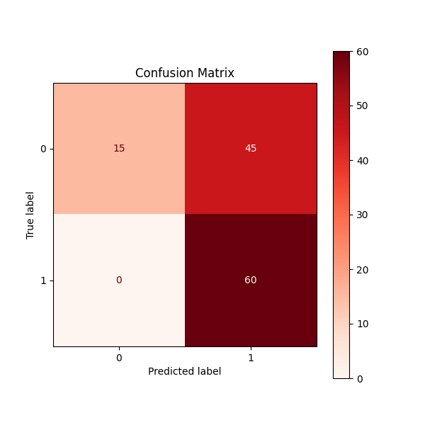
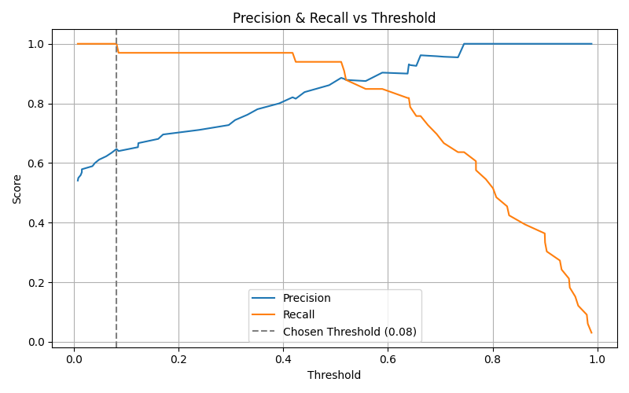

# 🫀 Heart Disease Risk Prediction using Machine Learning

This is my first Machine Learning project, where I built a logistic regression model to **predict the presence of heart disease** based on patient health data.

## 🎯 Objective

The goal is to **maximize recall** to ensure that **no potential heart disease patient is missed**, even if it means sacrificing some accuracy or precision — because in healthcare, catching every real case matters.

---

## ✅ Key Results

- **Recall (Sensitivity)**: **100%** – all actual patients were detected
- **Precision**: 57% – some healthy individuals were over-flagged
- **Accuracy**: 70% – due to false positives
- **F1-score**: 0.80 – balanced performance

---

## 📊 Why this matters

In real life, **missing a heart patient can be fatal**, while falsely flagging a healthy person just leads to more testing.  
This model is ideal for **initial screening** – like a metal detector – better to over-warn than under-detect.

---

## 🧪 Technologies Used

- Python
- Scikit-learn
- Logistic Regression
- Pandas, NumPy
- Matplotlib, Seaborn
- Google Colab

---

## 📈 Model Evaluation

- Custom threshold tuning to increase recall
- Confusion matrix and precision-recall curve visualizations
- Manual threshold application using `predict_proba()`

---

## 📊 Visual Outputs

---

## 🚀 Future Improvements

- Try **Random Forest** and **XGBoost** for better accuracy
- Engineer more meaningful health features
- Calibrate probabilities for better threshold selection
- Deploy as a Streamlit or Gradio app

---

## 🧠 Dataset

Based on publicly available [Heart Disease dataset](https://www.kaggle.com/datasets/johnsmith88/heart-disease-dataset) [Heart Disease Cleveland dataset](https://www.kaggle.com/datasets/cherngs/heart-disease-cleveland-uci)from Kaggle.

---

## ▶️ Try it Live

---

## 📂 Project Structure

heart-disease-predictor/
├── HeartDiseasePredictor.ipynb <- Main notebook (Colab-ready)
├── heart_disease_model.py <- Clean Python script version
├── visuals/
│ ├── confusion_matrix.png
│ └── precision_recall_curve.png
├── requirements.txt
├── README.md
└── dataset.csv (or link to dataset)

---

## 📬 Contact

If you're an HR, ML engineer, or healthcare innovator — let’s connect!  
Feel free to open issues or drop suggestions.

#MachineLearning #HealthcareAI #FirstProject #RecallMatters #HeartDiseasePrediction #PythonML
